# Vikunja PWA

Unofficial third-party client for [Vikunja](https://vikunja.io). This project is
free and independent. It is not affiliated with, endorsed by, or maintained by
the official Vikunja project or its maintainers.

Vikunja PWA is a mobile-first, installable client for self-hosted Vikunja
instances. It uses the real Vikunja API and data model, wrapped in a faster,
touch-friendly interface with real project and task trees, a calendar, and
offline editing. It runs its own small backend in front of Vikunja, which holds
your login server-side, so your Vikunja token never reaches the browser.

## Features

### Views

- **Calendar** in month, week and day. Drag a task to reschedule it, drag its edge to change how long it runs, or tap an empty day or hour slot to add one already dated to that spot. Overlapping items stay readable instead of collapsing into slivers.
- **Gantt** planning with zoom presets, dependency arrows, progress and priority on the bars, assignee and label chips, and direct drag or resize scheduling.
- **Kanban** with full drag and drop: reorder in a column, move across columns, drop onto a card to make it a subtask, move from the task menu, and complete or reopen a task by moving it in or out of the done column.
- **List and table** views, plus **Today**, **Inbox** and **Upcoming** screens.
- **Saved filters** built from a cross-project form (status, project, label, priority, due date, text, favourites, sort order) or written as raw clauses. They open as normal project workspaces.
- **A default view per device**, set separately for desktop and mobile.

### Projects and tasks

- Nested sub-projects, with task trees you expand in place.
- Quick add that stays open after Enter, with dates, `+project`, `*label`, `@assignee`, `!priority` and repeats highlighted as you type.
- Subtasks inline, labels on the cards, favourites, priorities and due dates.
- Task detail with comments, emoji reactions, attachments, assignees and per-task subscriptions.
- Bulk edit across list and tree views.
- Search across every project, from any screen.
- Project backgrounds: upload your own, pick from Unsplash, or remove.
- Drag to reorder or re-parent both tasks and projects.

### Offline

- Install it and it opens without a connection, with your projects and tasks already there.
- Edits you make offline queue up and sync when you reconnect, and you can see what is still pending.
- Attachments, sharing changes and admin actions still need a live connection.

### Sharing and collaboration

- Teams, with member and admin management.
- Share a project with users or teams as read-only, writer or admin.
- Link shares, optionally password protected, that open in their own view.
- The app shows the access the current session actually has before offering controls, so nothing dangles that you cannot use.

### Account and security

- Sign in with a password (including "stay logged in"), an API token, or OpenID Connect.
- Two-factor auth, CalDAV tokens and scoped API tokens.
- See and revoke your active Vikunja sessions.
- Change your password or email, export your data, or schedule account deletion.
- Avatars, timezone, and notification preferences per category.
- Registration and password-reset options appear only when your server actually supports them.

### Integrations

- Webhooks for a user or a project, with event selection and an optional secret.
- Migration imports from Todoist, Trello, Microsoft To Do, TickTick, WeKan, CSV and Vikunja exports, with a guided analyse, map and preview flow for CSV.
- Background refresh, so changes made elsewhere appear without a manual reload.

### Administration (optional)

- Create, edit, enable, disable, reset the password for, and delete users.
- SMTP settings with delivery diagnostics.
- Configure migration providers, including the redirect URLs they need.
- Requires an operator allowlist and a bridge to your own Vikunja container. Without it, the rest of the app works normally.

Release history lives in [CHANGELOG.md](CHANGELOG.md).

## Screenshots

All screenshots are from the `0.5` flat-design release.

### Demo

[](https://youtu.be/NCnS1X4c3dg)

### Mobile

| Today | Projects | Project detail |
|:---:|:---:|:---:|
| 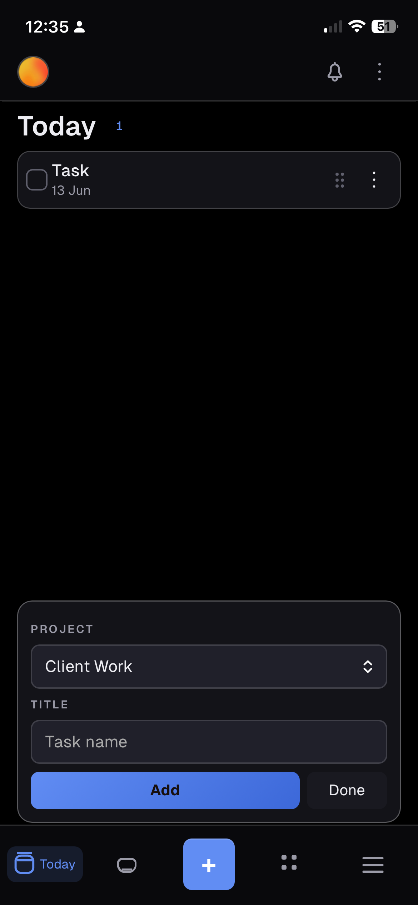 | 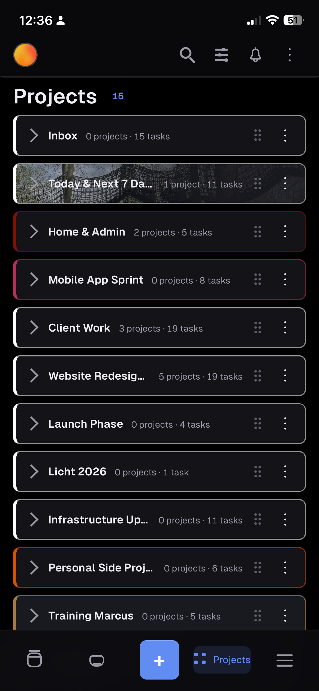 | 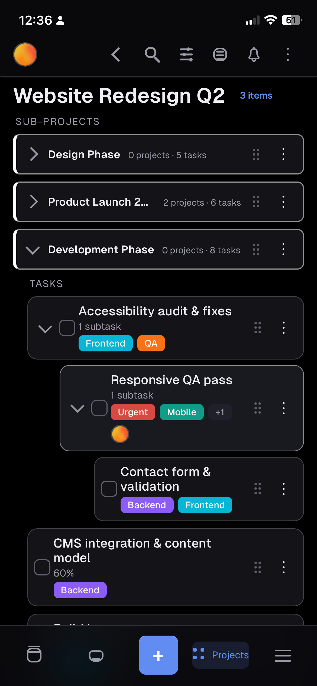 |

| Task detail | Project background & access | Settings |
|:---:|:---:|:---:|
| 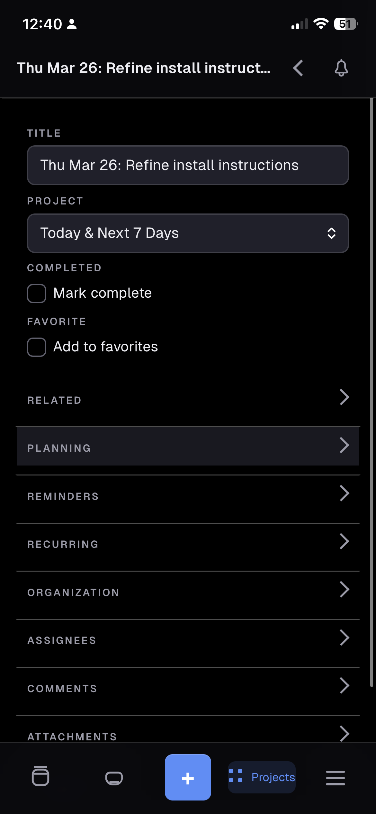 | 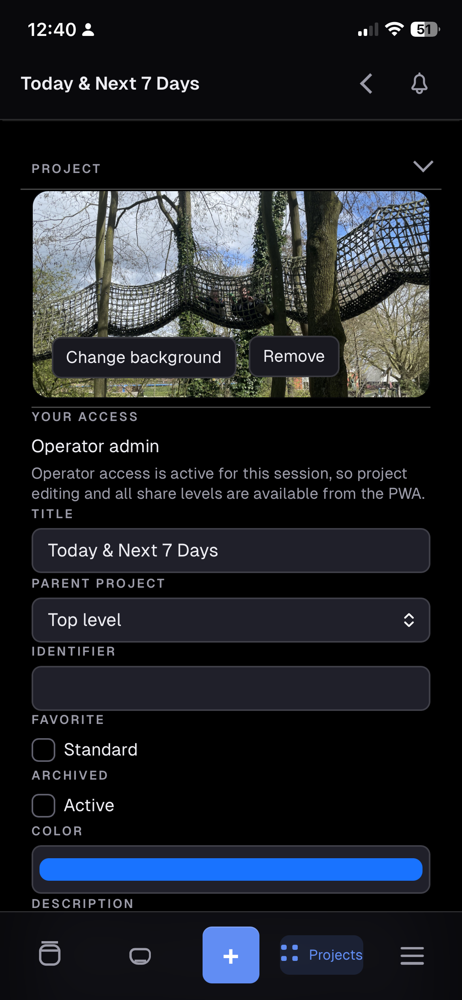 | 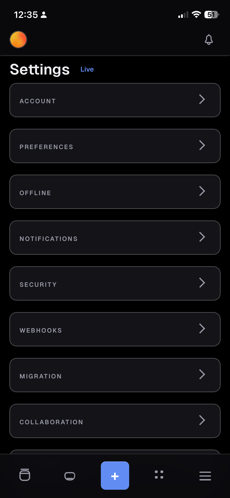 |

#### Light mode

| Today | Project board | Task detail |
|:---:|:---:|:---:|
| 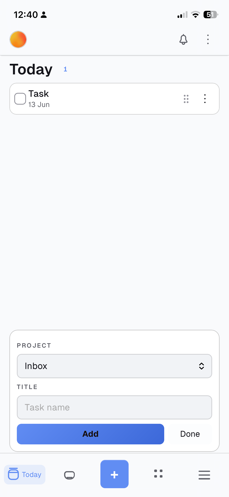 | 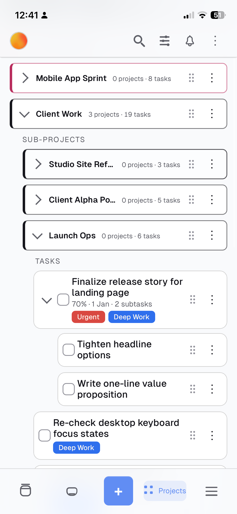 | 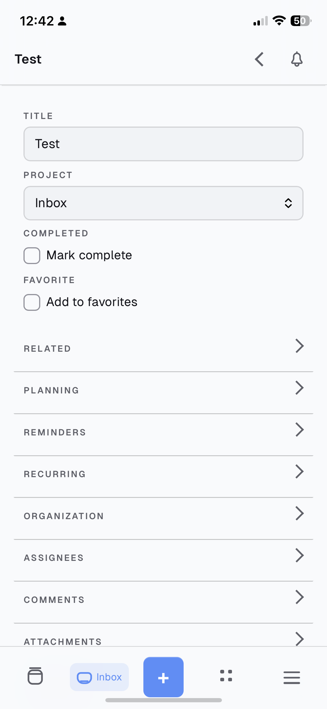 |

| Settings | Project background |
|:---:|:---:|
| 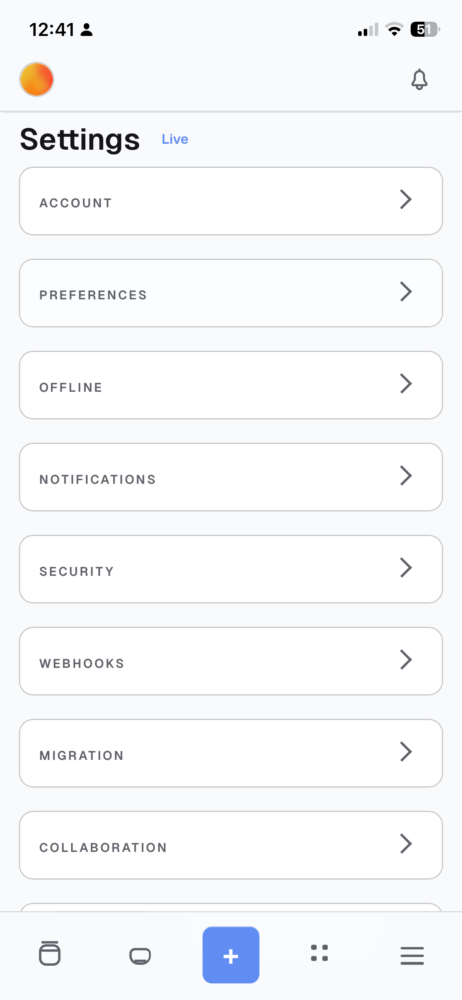 | 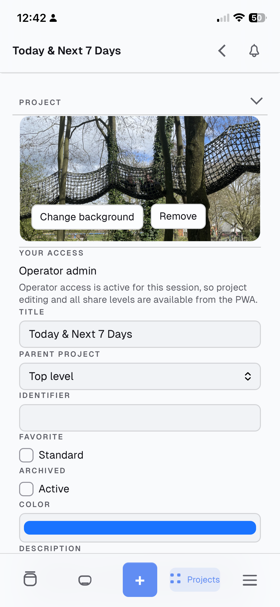 |

### Desktop

| Today | Projects | Gantt + inspector |
|:---:|:---:|:---:|
| 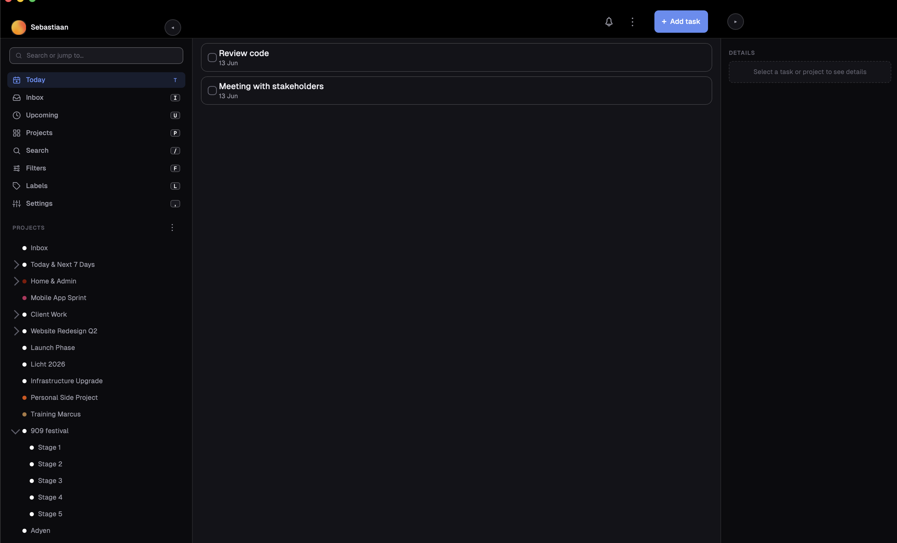 | 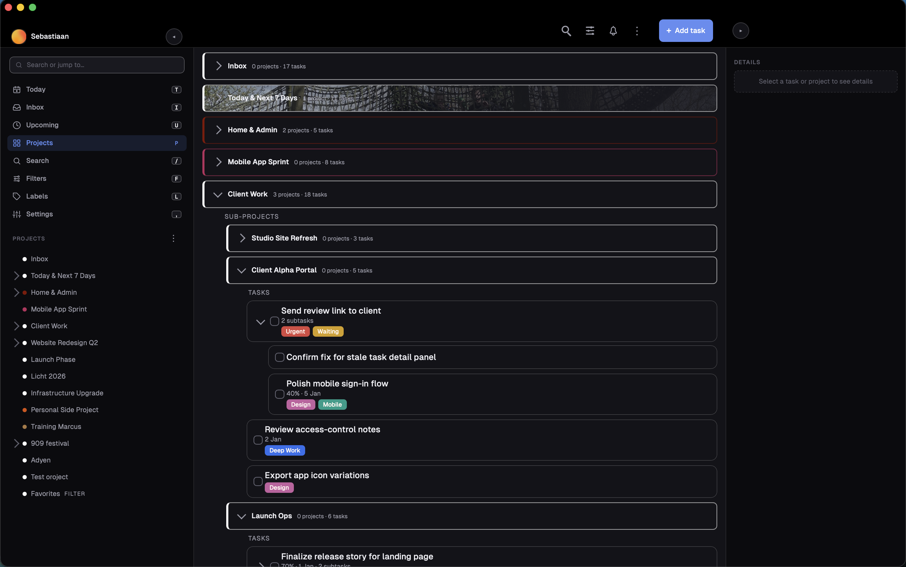 | 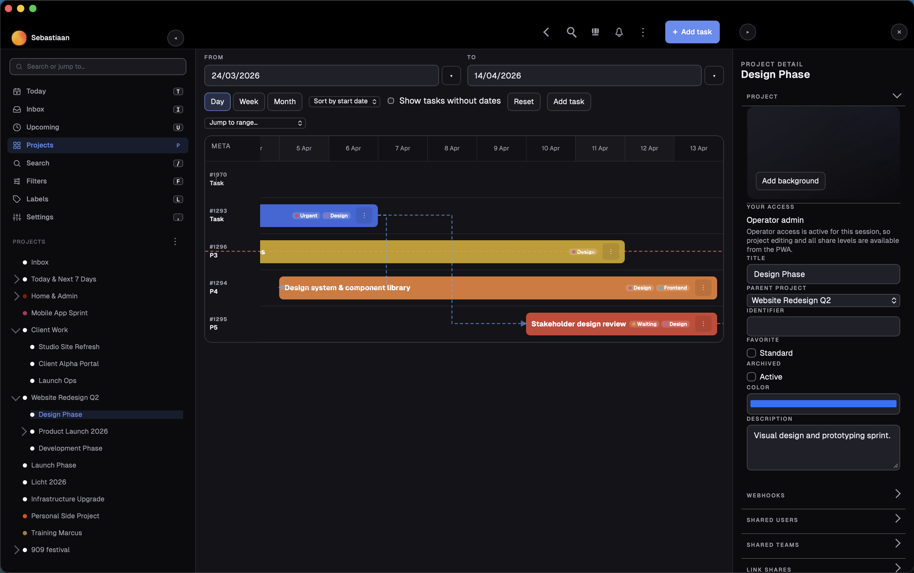 |

| Search | Settings |
|:---:|:---:|
| 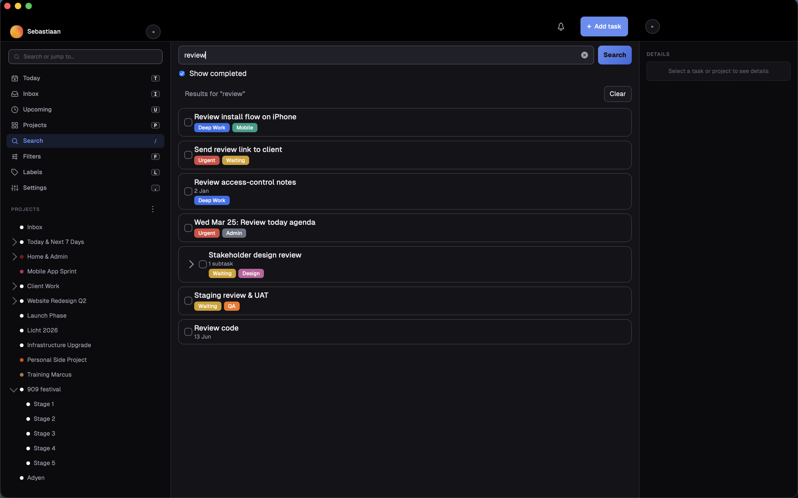 | 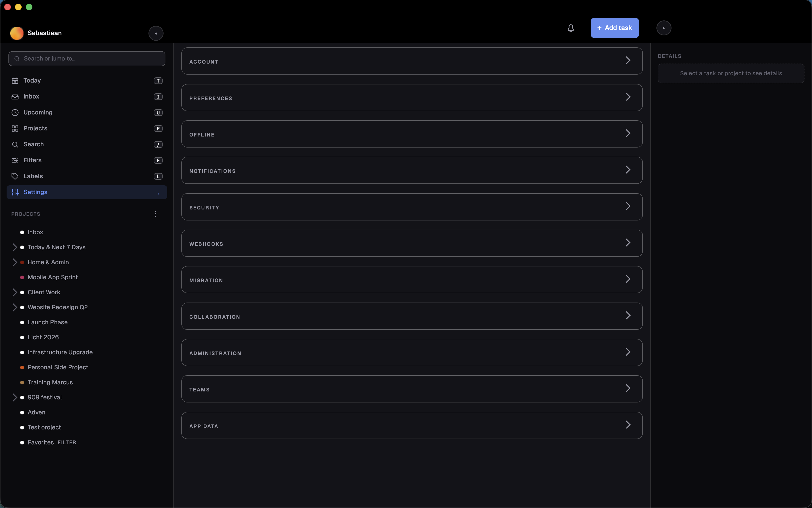 |

## Prerequisites

- Node.js >= 20.0.0
- npm
- Optional: Docker / Docker Compose for the included container deployment example
- A reachable Vikunja instance
- Current development and CI validation run on Node 24.x
- For iPhone/iPad PWA validation: a trusted HTTPS origin and local/dev certificates
- For local UI smoke runs: Playwright Chromium installed via `npx playwright install chromium`

## Quick start

1. Copy `.env.example` to `.env`.
2. Set what you need:
   - optionally `VIKUNJA_DEFAULT_BASE_URL`
   - leave `VIKUNJA_DEFAULT_BASE_URL` blank if you want the server field to start empty
   - optionally `APP_PUBLIC_ORIGIN`
   - optionally `APP_TRUST_PROXY=true` when the app is behind a trusted reverse proxy that sets `X-Forwarded-For`
   - optionally `APP_SESSION_STORE_PATH`
   - optionally `APP_SESSION_KEY_PATH`
   - optionally `HOST`
   - optionally `PORT`
3. Optional HTTPS and bridge runtime files:
   - put runtime-only certs or SSH keys in `./deploy/`
   - these files are intentionally ignored by git and excluded from Docker image builds
4. If you want admin user management through the Vikunja CLI bridge:
   - same-host Docker deployment:
     - `VIKUNJA_BRIDGE_MODE=docker-exec`
     - `VIKUNJA_CONTAINER_NAME`
     - `VIKUNJA_CLI_PATH`
   - development from a Mac against a VM-hosted Vikunja Docker container:
     - `VIKUNJA_BRIDGE_MODE=ssh-docker-exec`
     - `VIKUNJA_SSH_DESTINATION`
     - optionally `VIKUNJA_SSH_KEY_PATH`
     - `VIKUNJA_CONTAINER_NAME`
     - `VIKUNJA_CLI_PATH`
5. Optional development fallback only:
   - `VIKUNJA_BASE_URL`
   - `VIKUNJA_API_TOKEN`
   - not recommended for production
6. For local development, use two terminals:

```bash
npm run dev
npm run dev:react
```

7. Open the React app:

```text
http://127.0.0.1:4300
```

For a first phone test on the same Wi-Fi/LAN, open:

```text
http://<your-mac-ip>:4300
```

If you keep the default `HOST=0.0.0.0`, the server will listen on the local network as well.

For iPhone offline-shell and browser-notification testing, use trusted HTTPS instead:

```env
APP_PUBLIC_ORIGIN=https://<your-mac-ip>:4300
APP_HTTPS_KEY_PATH=/app/deploy/key.pem
APP_HTTPS_CERT_PATH=/app/deploy/cert.pem
COOKIE_SECURE=true
APP_TRUST_PROXY=false
```

Then place those files in `./deploy/`, open the HTTPS origin in Safari, and add that HTTPS app to the Home Screen.

For a production-style local run:

```bash
npm run build
npm start
```

## Docker

The included `docker-compose.yml` now defaults to the simplest public path:

- plain HTTP
- no HTTPS cert requirement
- no admin bridge requirement

Minimal Docker Desktop test:

1. Copy `.env.example` to `.env`
2. Optionally set `VIKUNJA_DEFAULT_BASE_URL`
3. Leave it blank if you want a clean public/shareable benchmark with no prefilled server URL
4. Run `docker compose up --build`
5. Open `http://localhost:4300`

Optional advanced Docker features stay in the same compose file and are enabled by environment variables:

- HTTPS: set `APP_HTTPS_CERT_PATH`, `APP_HTTPS_KEY_PATH`, and `APP_PUBLIC_ORIGIN`, then place the cert files in `./deploy/`
- same-host admin bridge: set `VIKUNJA_BRIDGE_MODE=docker-exec`
- remote admin bridge: set `VIKUNJA_BRIDGE_MODE=ssh-docker-exec` and the SSH vars, then place the SSH key in `./deploy/`
- operator authorization: set `ADMIN_BRIDGE_ALLOWED_EMAILS=you@example.com`
- writable SMTP/admin config:
  - for local `docker-exec` deployments where this PWA also runs in Docker, set `VIKUNJA_ADMIN_SOURCE_HOST_PATH` to the authoritative upstream Vikunja deployment directory on the host
  - then point `VIKUNJA_HOST_CONFIG_PATH` or `VIKUNJA_COMPOSE_PATH` at the mounted in-container path under `/app/admin-source`
  - set `VIKUNJA_HOST_CONFIG_PATH` to a persistent Vikunja config file, or
  - set `VIKUNJA_COMPOSE_PATH` to the authoritative upstream Vikunja `docker-compose.yml`

### Writable SMTP Setup

If you want the SMTP form in the PWA to be editable and to support `Apply & Restart`,
the PWA must be able to reach the real Vikunja deployment config source.

The PWA does not write into the running Vikunja container filesystem.
It writes to one of these authoritative sources instead:

- a persistent Vikunja config file via `VIKUNJA_HOST_CONFIG_PATH`
- the upstream Vikunja `docker-compose.yml` via `VIKUNJA_COMPOSE_PATH`

#### Same-host Docker example

Use this when:

- the PWA runs in Docker
- Vikunja runs in Docker on the same host
- the PWA bridge mode is `docker-exec`

Add these to the PWA `.env`:

```env
VIKUNJA_BRIDGE_MODE=docker-exec
VIKUNJA_CONTAINER_NAME=vikunja-vikunja-1
ADMIN_BRIDGE_ALLOWED_EMAILS=you@example.com
VIKUNJA_ADMIN_SOURCE_HOST_PATH=/home/admin/docker/vikunja
VIKUNJA_ADMIN_SOURCE_CONTAINER_PATH=/home/admin/docker/vikunja
VIKUNJA_COMPOSE_PATH=/home/admin/docker/vikunja/docker-compose.yml
```

What this does:

- `VIKUNJA_ADMIN_SOURCE_HOST_PATH` bind-mounts the real upstream Vikunja deployment directory into the PWA container
- `VIKUNJA_ADMIN_SOURCE_CONTAINER_PATH` makes that directory available at the same absolute path inside the PWA container
- `VIKUNJA_COMPOSE_PATH` points the PWA at that mounted in-container compose file

Using the same absolute path matters when the upstream `docker-compose.yml` uses relative bind mounts like `./files` and `./db`.
That lets `Apply & Restart` recreate Vikunja with the correct bind-source paths.

Do not point `VIKUNJA_COMPOSE_PATH` at a raw host path like `/home/admin/docker/vikunja/docker-compose.yml` when the PWA itself runs in Docker unless that same host directory is also mounted into the PWA container at the same absolute path.

#### SSH bridge example

Use this when:

- the PWA runs on a workstation or separate host
- Vikunja runs on a remote Docker host
- the PWA bridge mode is `ssh-docker-exec`

Add these to the PWA `.env`:

```env
VIKUNJA_BRIDGE_MODE=ssh-docker-exec
VIKUNJA_SSH_DESTINATION=admin@vikunja-host
VIKUNJA_SSH_PORT=22
VIKUNJA_SSH_KEY_PATH=/app/deploy/id_ed25519
ADMIN_BRIDGE_ALLOWED_EMAILS=you@example.com
VIKUNJA_COMPOSE_PATH=/home/admin/docker/vikunja/docker-compose.yml
```

In SSH mode, `VIKUNJA_COMPOSE_PATH` is a remote absolute path on the Vikunja host.
You do not need `/app/admin-source` in this mode.

#### After changing `.env`

Rebuild and restart the PWA container:

```bash
docker compose build --no-cache
docker compose up -d
```

Then verify:

```bash
curl -s http://127.0.0.1:4300/health
curl -i -s http://127.0.0.1:4300/api/admin/config/mailer
```

The second command should return `401 Unauthorized` when not logged in, which confirms the route exists.

#### Troubleshooting

- SMTP form is read-only:
  - `VIKUNJA_HOST_CONFIG_PATH` and `VIKUNJA_COMPOSE_PATH` are both unset, or the configured path is not reachable from the PWA runtime
- Flashes `No services were found in the configured Docker Compose file`:
  - the compose file path exists in config but the file is not actually readable from the PWA process, commonly because a Docker host path was used inside a container without a bind mount
- Save works but `Apply & Restart` fails:
  - in same-host `docker-exec` mode, the upstream Vikunja directory is mounted into the PWA container at a different path than the host path, so relative bind mounts in the upstream compose file cannot be recreated correctly
  - set `VIKUNJA_ADMIN_SOURCE_CONTAINER_PATH` to the same absolute path as `VIKUNJA_ADMIN_SOURCE_HOST_PATH`, and point `VIKUNJA_COMPOSE_PATH` at that same absolute path
- User administration says only authorized operator accounts may manage users:
  - `ADMIN_BRIDGE_ALLOWED_EMAILS` is unset, or the signed-in Vikunja account email is not in that allowlist
- Bridge features are unavailable:
  - `VIKUNJA_BRIDGE_MODE`, container name, SSH destination, Docker socket access, or SSH key config is missing or unreachable

The checked-in Dockerfile now builds on Node 22, which matches the current frontend toolchain requirements and keeps container builds free of Node engine warnings.

Deployment safety note:

- keep `.env` as a real file on the deployment host
- do not symlink `.env` to another machine or workstation path
- keep runtime-only certs and SSH keys local to the deployment host under `./deploy/`
- if you sync the repo to another machine, exclude `.env`, `deploy/*.pem`, and other local runtime files from the sync

## Versioning And Build Identification

Settings → App Data shows three identifiers:

- **App version** is the release number from `package.json` (for example `0.5.0`). It is bumped by hand at each release cut, not per deploy.
- **Server build** and **Client build** identify the exact deployed code. They are stamped automatically at build time as `YYYY-MM-DD-<git commit>` (with a `-dirty` suffix when built from uncommitted changes), so every deploy is distinguishable without manual bumps.

How the stamp is resolved:

1. A `build-info.json` at the repo root, written by `node scripts/generate-build-info.mjs`. Deploy scripts should run this before shipping; it refuses to produce an unstamped deploy with `--require-git`.
2. Otherwise live git metadata at build/start time.
3. Otherwise `unknown`.

Git checkouts get correct stamps with no extra steps. Docker builds exclude `.git` from the build context, so run `node scripts/generate-build-info.mjs` before `docker compose up --build` if you want the image stamped; without it the build IDs show `unknown`.

## CLI Bridge (Optional)

The Vikunja CLI bridge is optional. You only need it if you want to create,
edit, disable, or delete Vikunja users from inside this app, run `testmail`,
run `doctor`, or apply writable SMTP/admin-config changes. Core task, project,
sharing, offline, and notification flows all work without it.

- Why it exists: Vikunja does not expose instance user CRUD through its REST API, so this app uses the Vikunja CLI from the server side.
- Supported modes:
  - `docker-exec` for same-host deployments where the app server can reach the Vikunja container runtime
  - `ssh-docker-exec` for a local workstation or separate app host reaching a remote Docker host over SSH
- Authorization:
  - set `ADMIN_BRIDGE_ALLOWED_EMAILS` to the signed-in Vikunja account emails that may use bridge/admin routes
  - without that allowlist, the PWA treats bridge/admin features as unauthorized
- SMTP/admin-config source modes:
  - if `VIKUNJA_HOST_CONFIG_PATH` is set, SMTP becomes `file-backed` and the PWA can save config there
  - if `VIKUNJA_COMPOSE_PATH` is set, SMTP becomes `compose-env` and the PWA manages the upstream Vikunja compose env for mailer settings
  - if both are unset, SMTP stays `read-only`
  - in local `docker-exec` mode the path must be readable from the app process/container, which usually means mounting the authoritative host directory into `/app/admin-source`
  - in SSH mode the path is a remote absolute path on the Vikunja host
- Trust implications:
  - `docker-exec` implies Docker/socket-level access on the host running the app server
  - `ssh-docker-exec` implies SSH key-based access to the remote Docker host
- Without the bridge:
  - user-management, `testmail`, and `doctor` stay unavailable
  - SMTP stays read-only unless `VIKUNJA_HOST_CONFIG_PATH` or `VIKUNJA_COMPOSE_PATH` is configured locally
  - everything else in the app remains usable

Detailed operational, deployment, audit, and planning notes are intentionally
kept outside this public repo.

## How it works

- The browser never receives your Vikunja API token.
- The browser talks to a same-origin Node backend that owns the Vikunja credentials/session.
- For self-hosted Vikunja, the intended path is `Settings > Accounts` with username/password login.
- Password login supports Vikunja's native `Stay logged in` / `long_token` remembered-session mode.
- API token mode is also available. The token is submitted to the backend and kept out of browser storage.
- Account sessions are stored server-side in an encrypted local file, so ordinary backend restarts keep interactive sessions.
- To keep remembered Vikunja sessions valid across upstream restarts, the Vikunja deployment needs a fixed `service.JWTSecret` / `VIKUNJA_SERVICE_JWTSECRET`.
- Admin user lifecycle actions and bridge-only administration operations run through a backend-only Vikunja CLI bridge; the browser never gets Docker or CLI access.
- Administration exposes operator-gated lifecycle operations plus SMTP and migration-provider config. Instance-level user roles and global permissions are not exposed by the Vikunja CLI bridge.
- Deployment-level SMTP/admin config is only written to an explicit host config path. The running Vikunja container filesystem is never treated as the source of truth.
- Shared project links authenticate into a dedicated public/shared shell instead of the normal signed-in app shell.
- The app can also run directly over HTTPS with local certs for secure mobile PWA testing, including iPhone installed-app notification checks.
- `VIKUNJA_DEFAULT_BASE_URL` or `VIKUNJA_BASE_URL` may be either:
  - `https://vikunja.example.com`
  - `http://vikunja.local:3456`
  - or the full API URL ending in `/api/v1`

## Browser support

The app targets modern browsers with native ES2022 support. No polyfills are shipped.

Supported baseline targets:

- Chrome 100+
- Edge 100+
- Safari 16+
- Firefox 100+
- iPhone Safari in installed HTTPS PWA mode

Not supported:

- Internet Explorer
- legacy browsers without modern ES2022, service worker, or installed-PWA support

## Repo layout

```text
.
├── src/
│   ├── components/
│   ├── hooks/
│   ├── store/
│   ├── utils/
│   ├── App.tsx
│   ├── main.tsx
│   └── styles.css
├── public/
│   ├── icons/
│   ├── manifest.webmanifest
│   └── vendor/
├── tests/
│   ├── helpers/
│   └── smoke/
├── deploy/
│   └── .gitkeep
├── server/
│   ├── admin-bridge.mjs
│   ├── config.mjs
│   ├── cookies.mjs
│   ├── http.mjs
│   ├── rate-limit.mjs
│   ├── session-store.mjs
│   ├── static.mjs
│   └── vikunja-client.mjs
├── .env.example
├── .dockerignore
├── Dockerfile
├── docker-compose.yml
├── package.json
├── README.md
└── server.mjs
```

- `server.mjs`: server entrypoint and route wiring. In production it serves `dist/`.
- `server/`: extracted Node-side helpers for config, admin bridge execution, rate limiting, static serving, HTTP utilities, and Vikunja API access.
- `src/`: React application code, store slices, utilities, and migrated screens/components.
- `public/`: static assets copied by Vite into `dist/`, including icons, manifest, and the kept Sortable runtime.
- `deploy/`: optional runtime-only bind-mount directory for local certs or SSH keys. Contents are git-ignored and excluded from image builds.
- `tests/helpers/app-under-test.mjs`: unified smoke harness that builds `dist/` and boots the app server against it.
- Internal planning, audit, and deployment documents are intentionally kept outside the public repo.

## Known constraints

- This is an independent client, not a production-grade or officially supported one.
- Vikunja supports labels on tasks, but not project labels through the API routes used here.
- Offline covers cached reopen and queued task/project edits. Attachments, sharing changes, admin config, and security-admin actions need a live connection.
- Notification setup and test alerts work on supported desktop browsers and installed HTTPS iPhone web apps, and notification preferences are stored per category. Event-driven push delivery is not built yet.
- Administration is limited to user lifecycle: create, edit identity, enable/disable, reset password, and delete. The CLI bridge does not expose instance-user role editing.
- Administration also requires an operator email allowlist set in the deployment environment. Without it, the rest of the app still works.
- Todoist, Trello, and Microsoft To Do imports only return to this app if the redirect URL is updated in both Vikunja and the provider's developer app. Otherwise the import finishes in the stock Vikunja frontend.

## Testing

Install dependencies and run the local verification suite:

```bash
npm install
npm run lint
npm run build
npm run test:unit
npm run test:smoke:api
```

For the browser smoke pass, install Playwright Chromium once and run:

```bash
npx playwright install chromium
npm run test:smoke:ui
```

The full local verification command is:

```bash
npm run ci
```

CI runs the same suite via GitHub Actions (`.github/workflows/ci.yml`).

## Troubleshooting

- If the app is behind a trusted reverse proxy or Cloudflare Tunnel, set `APP_TRUST_PROXY=true` so same-origin mutation checks use the forwarded host and protocol.
- If iPhone offline shell or browser notifications do not work, use a trusted HTTPS origin and add the app to the Home Screen from Safari.
- If admin user management is unavailable, verify the optional CLI bridge environment variables on the server. The rest of the app should still work without it.
- If UI smoke tests fail locally before the browser starts, run `npx playwright install chromium`.
- If the shell looks stale after a rebuild/deploy, use `Settings > App Data > Refresh app data`.

